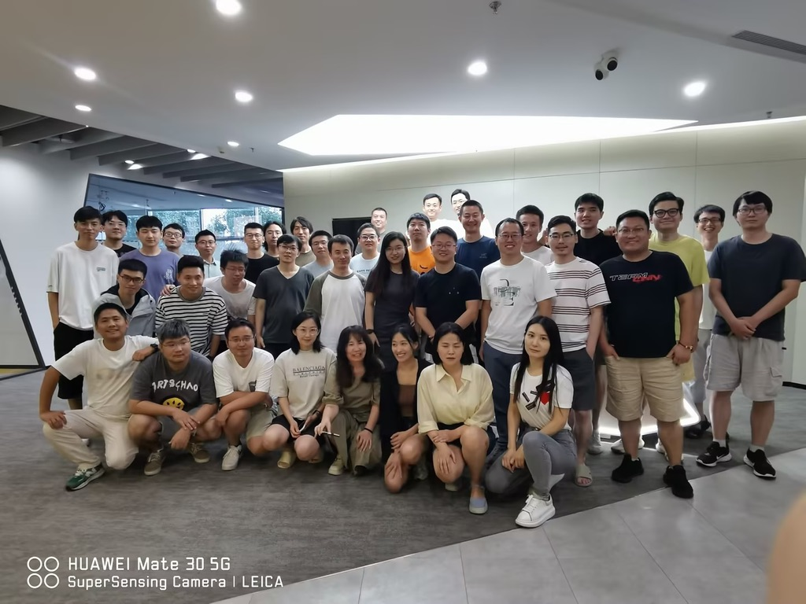

---
tags:
- blog
- 工作
---

# 非常炸裂的一段实习
> 【自2023.3至2023.8】

<iframe frameborder="no" border="0" marginwidth="0" marginheight="0" width=500 height=90 src="//music.163.com/outchain/player?type=2&id=410801745&userid=375567587&auto=1&height=66"></iframe>

## 1. 第一段 ONEFLOW

**持续时间：7天**

首先，北京的天氣简直就POS，可能以前一直在青岛和巴黎待着，来了北京直接地狱模式，整个上呼吸道系统严重不适。ps：来京第一天还遇到了沙尘暴，差点给我劝退了。

好说歹说，实习工作可算是开始了，我一个人在北京的生活也要开始了。

在 Oneflow 的实习我觉得非常 nice，主要是轻松，不加班，上班时间也非常弹性，也没有严格的上下级关系。部门也很小，一眼可以把办公区看穿。
刚开始的工作属于熟悉工作流程，不过几天之后就分配到测试小组之后就变了。以前从来没有接触过大模型的训练，更别提多机多卡的训练了（在法国实在是没有这么多资源哈哈哈）。新mentor真的一言难尽，但是对旁人的评价在blog里实在是难以启齿，就让我记在心里吧。

公司的人际关系让我非常意外，入职的第一天没有想象中的人员介绍，甚至同事之间连招呼也没打，自我介绍的环节自然也省略了（我讨厌自我介绍）。感觉自己就像一个螺丝钉安排在了固定的位置，螺丝钉自然是不需要人际关系的，不过好歹公司有另一个实习生坐在我的后面，我们很愉快地成了饭搭子（幸好没有到我认为最坏的地步）。
不过刚回国的那几天，每天对别人笑脸相迎，说着“早上好”，“明天见”，“周末愉快”之类。现在看来，想必同事也十分意外吧。

不过后面几天我适应地异常迅速，曾让我倍感焦虑的适应问题没想到在不知不觉中就完成了。我现在大概也成了比较“冷漠”的人了吧。

## 2. 第二段 光年之外 light year

**持续时间：70天**

> **眼见他起高楼，眼见他宴宾客，眼见他楼塌了**

> **老王和他的大模型**

在六道口的同方大厦工作了一星期就搬到五道口的搜狐网络大厦了。明明刚熟悉交通路线，说起来我大概有记地铁站的习惯，无论每一站开门方向亦或是两站的间隔时长我都会在心中默默记下。我好不容易完成生命科学园到六道口的“算法”，马上就要搬走了，又突然想到我在楼下食堂办的卡还没用完。有点体会到苏子的 **人生如逆旅 我亦是行人** 的感觉了。

起初在光年的工作继续延续了Oneflow的工作，但是新公司的勃勃朝气的活力让我非常兴奋。公司在马不停蹄地招人，而我看着身边的工位一个一个被占满，心中不禁感慨，这就是大佬和创业公司的节奏吗？那段时间我真的有种在参加“undercover boss”的真人秀的感觉，尤其是老王没有办公室，每次进门就能看到他的时刻（他的工位没有我的好哈哈哈哈，他的不是升降桌）。

这种兴奋的巅峰是融资到账的那一刻，老王大笔一挥买了好多卡。作为测试小组唯二的实习生，那段时间的工作也是极忙的，不过能接触到几千张A100，这种苦也不算什么了。公司到账的算力大部分的测试是由实习生来完成，我也学到了好多底层的硬件知识。

后来测完了硬件之后，又要测试模型的能力。这段时间也是异常痛苦。有的错误真的是玄学，并且测试环境必须完美无瑕且不能被中途扰动。有时候几个简单的case 要测试好几遍，不过我现在最感谢这段时间，毕竟测试组拥有着root的权限以及所有机器的权限，能进行百卡训练的机会真的不多。

这种狂热一直到端午节假期，这迄今为止我印象最深刻的端午节。

> 结论：端午节请了一天假，回来公司没了🤣

原因是老王一直受抑郁症的困扰，现在他撑不住要主动出局了，后果就是投资人纷纷撤资，资金被冻结。

周一上班公司弥漫着一股绝望的气息，一个三天的假期回来后仿佛过了数十年光景。

我亲手测的算力现在又要全释放了，数据组开的几百台机器下数据也要全释放了，仿佛前两个月的一切都是一场大梦，现在梦醒了。

## 3. 第三段 美团

**持续时间：6.10至8.04**

> **破局：美团出手，收购光年**

最终王兴好哥们还是出手了，出资收购了光年之外。
这样的结局其实对实习生来说没有太大的变化，但是对全职员工来说就不一样了吧，约定的股份期权，曾经为之奋斗的目标全都无了。

收购当天公司紧急召开了全员会，袁博交代了一下公司未来的发展情况。
也是从此开始吧，全员会终于不是互相扯皮了，终于有点有营养的东西输出出来了。

## 4. 第四段 OneFlow

**持续时间：8.04至今**

> **兜兜转转回到最初的起点**

美团的股票还有期权分配决定下来了，大多数人应该是不太满意。
光年之外一分为二，袁博带着OneFlow重新创业，唉🤦
我的实习也要结束了，不过正好处在公司找方向的时期，调研工作比较多，我也可以闲下来了。

可是离别怎么可能不难过

